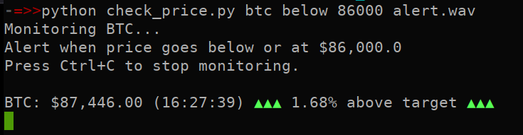
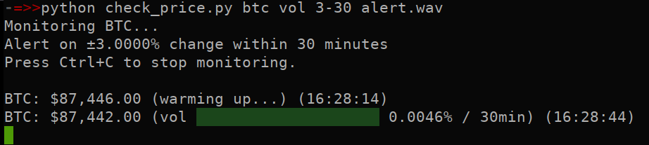

# Price Watch

Monitors crypto/stock prices and plays an alert sound when target is reached.
   * It will also send an alert on Linux or MAC OSX.
   * Run via `python` in a terminal or use the optional GUI

[](https://github.com/sadsfae/pricewatch/actions/workflows/flake8.yml)

## Usage

```
python check_price.py <symbol> <mode> <target> <wav>
```

### Price targets
```
python check_price.py btc above 100000 alert.wav
python check_price.py eth below 3000 alert.wav
```

### Volatility
```
python check_price.py sol vol 10-5 alert.wav    # 10% move in 5 mins
python check_price.py doge vol 5-15 alert.wav   # 5% move in 15 mins
python check_price.py tsla vol 5-10 alert.wav   # 5% move in 10 mins (needs POLYGON_API_KEY)
```

### Stocks (needs POLYGON_API_KEY)
```
export POLYGON_API_KEY="your_key"
python check_price.py tsla above 400 alert.wav
```

Get a free key at https://polygon.io

## Requirements
- Python 3 with `requests`
- mpv or mplayer

### GUI
To run the GUI:
```
python pricewatch_gui.py
```

## Installation
### Clone Repository
```bash
git clone https://github.com/sadsfae/pricewatch.git
cd pricewatch
```

### Copy .desktop file (optional)
```bash
cat > pricewatch.desktop <<EOF
[Desktop Entry]
Version=1.0
Name=Price Watch
Comment=Monitor crypto and stock prices
Exec=$(which python3) $(pwd)/pricewatch_gui.py
Path=$(pwd)/
Icon=utilities-system-monitor
Terminal=false
Type=Application
Categories=Utility;Finance;
EOF
```

### Install it to your local applications folder (optional)
```bash
mkdir -p ~/.local/share/applications/
mv pricewatch.desktop ~/.local/share/applications/
chmod +x ~/.local/share/applications/pricewatch.desktop
update-desktop-database ~/.local/share/applications/
```

## Screenshots
### CLI




### GUI

